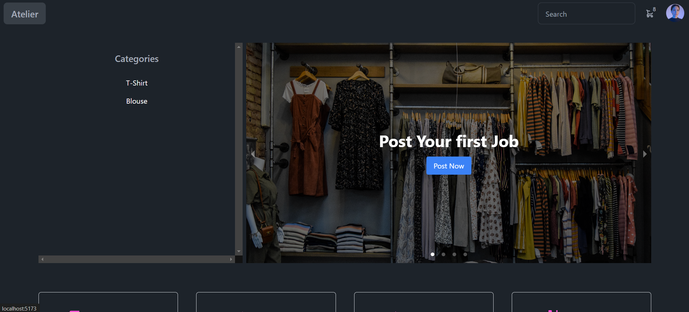

### Atelier: Connecting Consumers with Skilled Tailors

Atelier is a cutting-edge web application platform designed to seamlessly connect consumers with skilled tailors. Our platform serves as a dynamic marketplace where users can create accounts tailored to their specific needs—whether as a consumer seeking custom-made clothing or as a tailor looking to showcase their craftsmanship and bid on projects.

#### For Consumers
As a consumer, Atelier allows you to effortlessly bring your fashion visions to life. Simply create an account and post your project, detailing your specific requirements—such as fabric type, design specifications, measurements, and any other preferences. You can include images or sketches to provide a clear vision of your desired outcome. Once your project is posted, talented tailors will have the opportunity to bid on it, providing you with various options in terms of price, timeline, and style.

#### For Tailors
For tailors, Atelier offers a unique platform to expand your clientele and showcase your tailoring skills. Create a tailor account to gain access to a variety of project postings from consumers. You can browse through these projects and place bids on those that align with your expertise and interest. Tailors can include a portfolio of past work, customer reviews, and detailed proposals to attract potential clients. This competitive bidding process allows you to set your own rates and schedule, making it easier to manage your workflow and maximize your earnings.

#### Key Features
- **User-Friendly Interface:** Both consumers and tailors will find the platform easy to navigate, with intuitive features that simplify the process of posting projects and placing bids.
- **Detailed Project Posting:** Consumers can provide comprehensive details about their requirements, ensuring clarity and precision in their custom orders.
- **Competitive Bidding:** Tailors can compete for projects by offering their best bids, allowing consumers to choose from a variety of options.

- **Review and Rating System:** Both consumers and tailors can leave reviews and ratings, fostering a trustworthy community and maintaining high standards of quality.


## Website look like this




## Run Locally 

Clone the project

```bash
  git clone git@github.com:ankitbisen28/Food-order-app.git
```

Install dependencies

```bash
  npm install
```

Start your server on root

```bash
  npm start
```
## 🚀 About Me
Hello Everyone, 
 Hi, I'm Ankit Bisen, a 21-year-old Graduated Software Development Student in a bachelor of Vocational in Software development and experience with MERN Stack Development and Devops. 


## 🔗 Links
[](https://ankitbisen.live/)
[](https://www.linkedin.com/in/ankitbisen28)
[](https://twitter.com/ankitbisen28)


## 🛠 Skills
Javascript, HTML, CSS..., React, Nodejs, MUI, Express js. 

